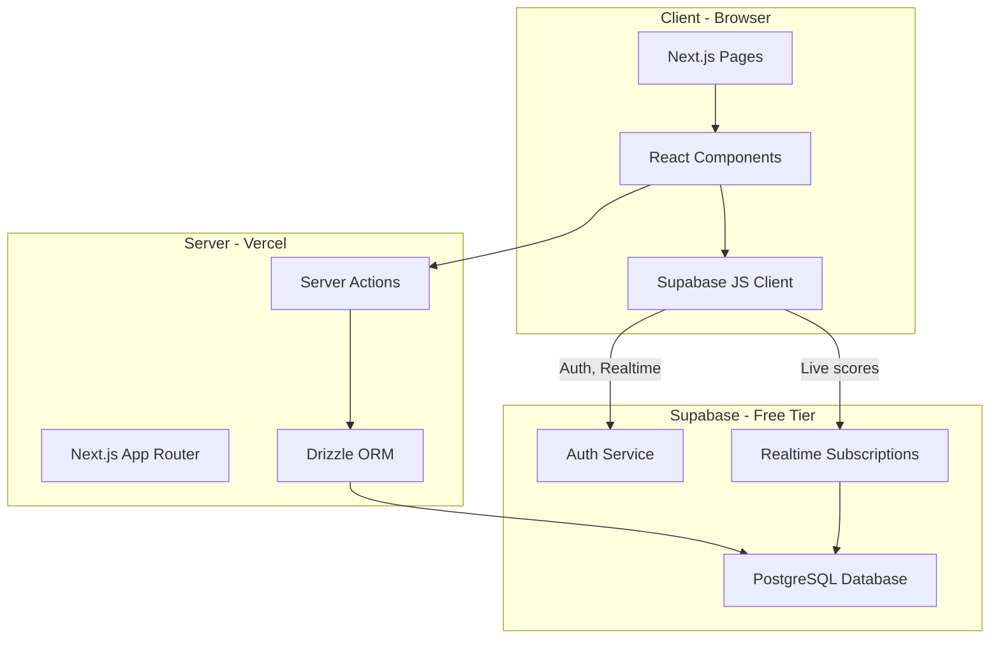
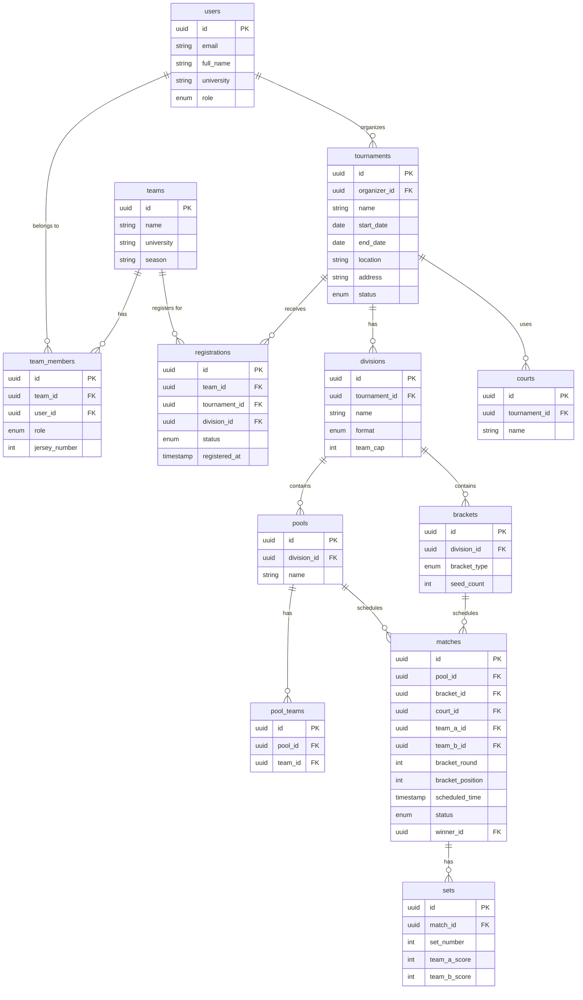

# Collegiate Club Volleyball Hub -- Project Plan

## Tech Stack (All Free Tier)


| Layer | Choice | Why |
| ----- | ------ | --- |


- **Framework**: Next.js 15 (App Router) -- full-stack React framework, SSR/SSG, API routes built in
- **Language**: TypeScript -- type safety across the entire stack
- **Styling**: Tailwind CSS + shadcn/ui -- rapid, beautiful, accessible UI with no cost
- **Database**: Supabase (PostgreSQL) -- free tier gives 500MB DB, 1GB storage, 50K MAU, built-in auth, and realtime subscriptions (useful for live scoring)
- **ORM**: Drizzle ORM -- lightweight, type-safe, SQL-like syntax, pairs well with Supabase Postgres
- **Auth**: Supabase Auth -- free, supports email/password + OAuth (Google), row-level security
- **Realtime**: Supabase Realtime -- free WebSocket-based subscriptions for live score updates
- **Hosting**: Vercel (free hobby tier) -- zero-config Next.js deployment, preview deploys on PRs
- **Validation**: Zod -- runtime schema validation shared between client and server

## Architecture Overview




## Data Model




## Project Structure

```
collegiate-club-volleyball-hub/
  src/
    app/                          # Next.js App Router
      (auth)/                     # Auth route group (login, signup)
      (dashboard)/                # Authenticated layout
        dashboard/                # Home dashboard
        tournaments/              # Tournament CRUD, detail, bracket views
        teams/                    # Team management, roster
        schedule/                 # Game schedule views
      api/                        # API routes (if needed beyond server actions)
    components/
      ui/                         # shadcn/ui primitives
      tournament/                 # Tournament-specific components
      bracket/                    # Bracket/pool display components
      scoring/                    # Live scoring components
      layout/                     # Nav, sidebar, footer
    lib/
      db/
        schema.ts                 # Drizzle schema definitions
        index.ts                  # DB client
        migrations/               # Drizzle migrations
      supabase/
        client.ts                 # Browser Supabase client
        server.ts                 # Server Supabase client
        middleware.ts             # Auth middleware
      validators/                 # Zod schemas
      utils/
        bracket.ts                # Bracket generation logic
        pool.ts                   # Pool play generation + standings calc
        scheduling.ts             # Court/time assignment algorithm
    hooks/                        # Custom React hooks
    types/                        # Shared TypeScript types
  public/                         # Static assets
  drizzle.config.ts               # Drizzle config
  tailwind.config.ts
  next.config.ts
```

## Key Feature Breakdown

### 1. Auth and User Management

- Supabase Auth with email/password signup
- Role system: `player`, `captain`, `organizer`
- Captains can manage their team roster; organizers can create tournaments
- Middleware protects authenticated routes

### 2. Team Management

- Create a team tied to a university
- Invite players by email or shareable link
- Roster management (add/remove members, set jersey numbers)
- Captain role for administrative actions

### 3. Tournament Creation

- Organizers create tournaments with: name, dates, location, description
- Add divisions (e.g., Men's A, Women's B) with format (pool play -> bracket, straight bracket)
- Set team caps per division, registration deadlines
- Tournament status lifecycle: `draft` -> `registration_open` -> `registration_closed` -> `in_progress` -> `completed`

### 4. Team Registration

- Captains browse open tournaments and register their team for a division
- Registration status: `pending` -> `confirmed` -> `checked_in`
- Organizers can approve/reject registrations

### 5. Pool Play and Bracket Generation

- **Pool play**: Algorithm distributes registered teams evenly across pools, avoiding same-university matchups where possible
- **Bracket generation**: Single-elimination or double-elimination brackets seeded from pool standings
- Pool standings calculated by: wins, then point differential, then head-to-head

### 6. Game Scheduling and Court Assignment

- Organizers assign courts to the tournament
- Auto-schedule pool play matches across courts and time slots
- Manual override for adjustments
- Schedule view filterable by team, court, or time

### 7. Live Scoring

- Organizers or designated scorers enter scores set-by-set
- Supabase Realtime pushes score updates to all viewers instantly
- Match status: `upcoming` -> `in_progress` -> `completed`
- Standings auto-update as matches complete

## Implementation Phases

### Phase 1: Foundation (Week 1-2)

- Project scaffolding (Next.js, Tailwind, shadcn/ui, Drizzle, Supabase)
- Database schema and migrations
- Auth flow (signup, login, logout)
- Basic responsive layout (nav, sidebar, mobile hamburger menu)

### Phase 2: Teams and Tournaments (Week 3-4)

- Team CRUD and roster management
- Tournament creation and listing
- Division configuration
- Registration flow

### Phase 3: Brackets and Scheduling (Week 5-6)

- Pool play generation algorithm
- Bracket generation (single/double elimination)
- Schedule builder with court assignments
- Interactive bracket/pool display components

### Phase 4: Live Scoring and Polish (Week 7-8)

- Real-time scoring interface
- Auto-updating standings
- Realtime bracket progression
- Mobile UX polish, loading states, error handling

## Free Tier Limits to Watch

- **Supabase free**: 500MB DB, 2GB bandwidth/month, 50K MAU, 500K edge function invocations -- sufficient for early usage
- **Vercel free**: 100GB bandwidth/month, 6000 build minutes/month, serverless function limits -- fine for a hobby/club project
- No credit card required for either service to start

